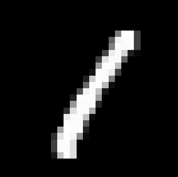

# MNIST Perceptron Classifier

## Overview

This is a basic implementation of a **multilayer perceptron neural network** to classify MNIST digits. The goal of this project is educational — to gain a better understanding of the fundamental building blocks of neural networks, particularly how **mulilayer perceptron** function and trains using backpropagation, before moving on to more advanced architectures like **Convolutional Neural Networks (CNNs)**.

---

## Getting Started

### Dependencies

This project uses [Astral's **uv**](https://docs.astral.sh/uv/) for dependency management and running Python scripts.

You can either:

- Install `uv` (recommended for this project) via their [official site](https://docs.astral.sh/uv/), **or**
- Convert the `pyproject.toml` into a `requirements.txt` and use `pip`.

### Running the Project

1. Clone the repository.
2. Navigate into the `src/` directory.
3. Run the following command:

```bash
uv run main.py
```

## Performance

Performance metrics (accuracy, precision, recall, etc.) will be posted here as the model improves.

*Status (2025-08-04)*:
When doing batches of 32, with a learning rate of 0.1 and a layered neural network accoring to:
```784 neurons -> 32 neurons -> 32 neurons -> 10 neurons```

,we achieve an accuracy of **92%**. To reach this accuracy I had to use softmax and change the loss function to cross entropy. The weights for this is included in the ```/data``` folder.

## Goals of the Project

- Understand the mechanics behind Perceptrons.
- Serve as a stepping stone toward more advanced models like CNNs.
- Learn how to structure and run Python ML projects using modern tools like `uv`.
- The goal of the project is NOT to achieve a high performing model, although it would be nice if the model performed well.

## Dataset

The dataset I use is the MNIST dataset. Some examples of images in the dataset is provided below:

| 0 | 1 | 2 | 3 | 4 | 5 | 6 | 7 | 8 | 9 |
|---|---|---|---|---|---|---|---|---|---|
|  |  |  |  |  |  |  |  |  |  |
